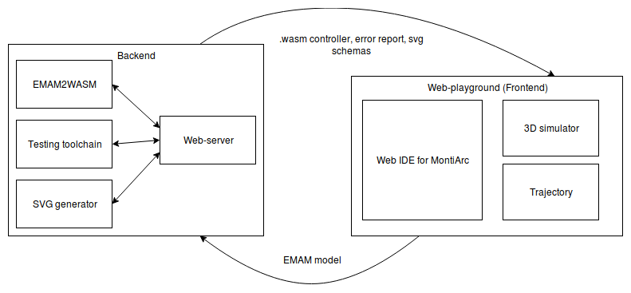
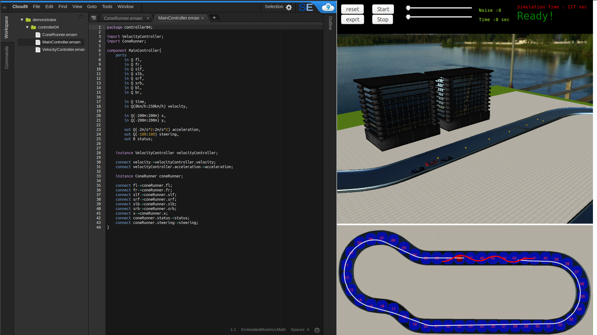
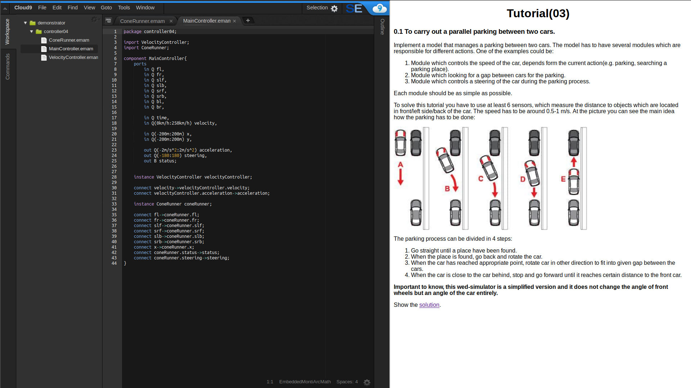

# Teaching playground for EmbeddedMontiArc language.

## Abstract
Self-driving vehicles are a very important part of our future. To inspire students to be involved in the 
future technology we invented a web-playground which allows creating controllers for a simulator and 
almost instantly see the result in 3D environment. We believe that visualization will motivate students and make the studying process more attractive due to gamification. Besides that, they are going to study how to work with Component and Connector (C&C) model language - EmbeddedMontiArc, to achieve the best results in short terms.

## Introduction
> this is a longer version of the abstract
> here please add one paragraph for the motivation
> add also one paragraph what C&C modeling is (general description)
> 
> http://www.se-rwth.de/publications/Component-and-Connector-Views-in-Practice-An-Experience-Report.pdf

> then also add a paragraph where you describe our EmbeddedMontiArc language (explain that we model textual, 
> what are ports, what a components, that we also support generics and units)

There is already exists the standalone simulator, which takes into account a lot of factors like a weather, it can use OpenStreetMap, and even has an own extensible physics engine. The issue here is that students have to download the simulator and then install it. If they have to do all these steps directly on the lecture it would be not the best experience due to the size of the simulator and the required computation resources. Also code sharing between the standalone application and e.g. separate tutorial is not the most convenient. Besides that at the moment, there is no tutorial for the existing simulator which can teach step-by-step the C&C paradigm by using EmbeddedMontiArc language. Because of the explained reasons, it was decided to develop a completely new simulator, which takes into account fewer details during the simulation. While it can manage all basic actions and use a full version of the existing language EmbeddedMontiArc.

## Running example

The final aim is to create a controller for a self-driving car. But the problem here is that the task is to complex. We have borrowed the idea from the agile development manifest to divide the large task into small ones. The small tutorials are based on the user-stories which allow getting faster feedback for students. Implementing simple tutorials and learning the basics of the language, students gain an experience in solving important tasks of which the controller for the self-driving car consists. Extremely hard to solve the big and complex task in one step, due to this reason, the dividing of the task is important. Successfully solved scenarios give important success feeling which motivates students.
The running example presents the process of creating controllers that solve given small but common tasks. To achieve the goal we have to understand the key aspects of the tasks. It helps to find which components we need to be able to find the solution. We are going to present two examples of tutorials in which controllers, for given tasks, will be created. The first task is to carry out parallel parking between two cars, and the last task is to successfully pass the elk test. To understand where we should start, let us dive into details of the tutorials.

### Parking Tutorial

The parallel parking is that you do everyday, if you have a car, or will do when you have it. But it is not so easy to perform this maneuver for an inexperienced driver. Because of this, there is a standard solution for that(see your picture below). The most interesting point in this example for us, like a people who is going to use C&C language, that this maneuver consists of several independent steps. Then we may build components and delegate the tasks to each of them, in the way that each component solves only one simple task. To manage the maneuver we have to perform the following steps: find place, go back putting the car in the space between the cars and drive forward aligning the car relative to the curb. During the parking process the given requirements should be met:

(P1) The car does not get into an accident during Parking  
(P2) At the end of the parking process, the car is parallel to a curb  
(P3) Distances to the front and to the rear car should be about the same  
(P4) The car should do only 3 steps to park (as well as shown in the picture)

### Elk Test Tutorial

Another test that we want to introduce is elk test. It is performed to determine how well a certain vehicle evades a suddenly appearing obstacle. These days, the test is performed by major automaker, because it proves the ability of a car to maneuver on average speed (60 km/h) without losing the control of the car. In our context, this test gives the feeling how the car responds on the objects on the track and how maneuverable it can be, depends on a speed. To pass the elk test the following requirements should be met:

(E1) The car does not drive into cones during the test  
(E2) It should drive on the shortest path, be as closer as possible to cones  
(E3) It must not leave the testing area and violate a track boundaries  
(E4) The start and end positions are specified  
(E5) The car has to drive between every two cones (shown in the picture)  

Each tutorial is like a module, it has all required elements inside the package. It comprise a bunch of files, which includes:  
1. Description of the tutorial, this is actually the text which students are reading to understand the task and find some useful hints and recommendations for the implementation.
2. Solution description, gives a detailed specification how to solve the current task and displays a working code solution.
3. Sample controller, the controller which has been implemented in advance and pass the current test.
4. Environment configuration file, which contains all important objects with their positions.  
5. Sample trajectory, it is used to check implemented by the student solution.

To prepare the simulator environment for tutorials, a configuration file is used. The configuration defines an initial position of the car. For each tutorial the position specified depends on the task and an area on the track where an action is going to happen. Also in the configuration are specified objects on the track and their positions. It is really convenient to have configurations for different tutorials, because it gives flexibility during the preparation tutorial process and simplified the building new ones.  

## Existing Solutions with Tutorial Character

In this section we present how tutorials are met by other tool vendors for their languages. We have taken in consideration different tutorials from different areas.

### Rust
Rust is a very popular programming language the prevalence of which is growing every day. It has a consistent tutorial which describes language constructs with gradually increasing complexity. It has the informative and structured index, where users can easily jump from one topic to another almost instantly and then just go back to the place where he was reading before. They use highlighted ares to show some code examples, which facilitate understanding of presented materials.

### Microsoft Z3 Solver
Z3 is a state-of-the art theorem prover from Microsoft. They provide similar experience compare to Rust tutorial but have some improvements, which actually simplify the studying process. We meant the possibility to execute the code from the current tutorial directly in the browser and see the result almost instantly due to in-browser execution. It helps to see the direct binding between written commands and the real result, that improves understanding of given material.

### Octave Online 
Octave Online is web-playground fot a high-level language Octave, which is primarily intended for numerical computations. It has a simple and intuitive interface despite the complexity of the internal implementation. It provides directly in a browser fast execution with errors handling. Even if you do complex computations it is not needed to install any software on the PC. Everything works out of the box.

### Wolfram Alpha
Wolfram Alpha is a very powerful tool, which works by using expert-level knowledge and algorithms to automatically answer questions, do analysis and generate reports. It has one very interesting and useful feature, which provide the interactive visualization of the given data. The idea behind that is that you can "feel" how one or another parameter influences on the final result. It promote a better understanding of dependencies between the components or elements of the system.

### TypeScript Playground
TypeScript is a typed superset of JavaScript. It has a clean and simple playground which shows the difference and benefits of TypeScript over JavaScript. It has preloaded examples which actually show this difference and a user can see distinction in the direct comparison. What, again, gives the better understanding and facilitates further analysis(R7).

### Swift Playgrounds
Swift Playgrounds has been created for teaching the Swift language in a game form. You can create small programs that instantly show the results of the code that you write. From the right side of the screen is shown a 3D world where an action is happen. The tutorials are pretty simple but the concept is very interesting. They have automatic verification of the correctness of an implemented solution in the 3D environment. To produce many diverse game oriented tutorials, it would be convenient to have simple 3D models importing which can use different models from various 3D editors.

Thoroughly analyzed the projects described above, we have derived the following list of requirements for our tool:

(R1) 3D visualization for demonstration purposes  
(R2) Simple, clean and intuitive interface  
(R3) Work on any operating system and without installation  
(R4) Automatic verification of obtained results  
(R5) Import and use existing 3D models for the simulation
(R6) Displaying the object's trajectory
(R7) Integrated testing support

The table summarizes the comparison between the all considered tutorials.
(+ support, P partially support)

|    | Z3 Solver | Octave online | Wolfram Alpha | TypeScript PG | Swift PG | Rust | EMAM PG |
|:--:|:---------:|:-------------:|:-------------:|:-------------:|:--------:|:----:|:-------:|
| R1 |     -     |       +       |       +       |       -       |     +    |   -  |    +    |
| R2 |     +     |       +       |       +       |       +       |     +    |   +  |    +    |
| R3 |     +     |       +       |       +       |       +       |     -    |   +  |    +    |
| R4 |     -     |       -       |       -       |       -       |     +    |   -  |    +    |
| R5 |     -     |       -       |       -       |       -       |     -    |   -  |    +    |
| R6 |     -     |       -       |       P       |       -       |     P    |   -  |    +    |
| R7 |     -     |       -       |       -       |       -       |     -    |   -  |    +    |

Let us take a closer look at the difference between the tutorials regarding to the derived requirements.  
**(R1) 3D visualization for demonstration purposes:** Three considered tutorials have a 3D visualization. The Octave online has a possibility to generate plots and graphics for given data. The Wolfram Alpha has a very powerful tool which can generate 3D models and you can even interact with them and see the changes in a real time. Whereas the Swift Playground has the most advanced 3D world which is like a part of the tutorial and result presentation.  
**(R2) Simple, clean and intuitive interface:** This is the only requirement which all tutorial are satisfied. We believe that it is very important to have an understandable and clear interface which does not distract from the educational process.  
**(R3) Work on any operating system and without installation:** All examined tutorials have web-implementation and work without installation, except the Swift tutorial, which has only iOS realization.  
**(R4) Automatic verification of obtained results:** Only one among the examined tutorials has a gaming base verification of a solution correctness. It causes additional interest in the studying process, and can be the motivation to keep solving the tasks, by analogy with computer games.  
**(R5) Import and use existing 3D models for the simulation:** None of the tutorials have a feasibility to create tutorials quickly and efficiently, using the previously created models and configurations. An example of reusing a 3D object can be a cone that is used in many exercises. This feature, in our opinion, simplifies the process of creating new tutorials and decrease the time which has to be invested in the creation process.  
**(R6) Displaying the object's trajectory:** Wolfram Alpha and Swift PG, we could say, partially support this feature in case that you can see the whole process of movement of the object from the very beginning to the end. But we decided to improve the concept and add the separate window which permanently displays a traversed route of the object, for better visual perception and visual comparison of results. In our case the object is a car.  
**(R7) Integrated testing support:** None of the tutorials have integrated testing options. Due to the specificity of our tutorial, the tests, for us, play an important role. Writing the streaming test for a component we can be sure that it reacts properly to the incoming data. Tests make the components more reliable and robust. Because of the using the C&C language, it is great to be sure that each component of a composed model behaves correctly.  
Taking into account all these derived requirements we going to start working on the architecture.

## Architecture

A software architecture refers to the high-level structures of a software system. The selection of a suitable architecture is very important at the initial design stage. In our case, EmbeddedMontiArc is already developed as self-containing services based on .jar files. Due to the derived requirement R3, we have to develop a web-based application. Therefore on the server-side, some services, from EmbeddedMontiArcStudio, can be selected and integrated. But still, one server-side component is missing. The server must handle multiple users at the same time, and the server must do the messaging from the back-end to the front-end. Students should get a response from the server, to receive compiled controller or just fix errors which can appear during the compilation process. The EmbeddedMontiArcStudio has its own 3D simulator, which has a lot of powerful features. But it has some weaknesses, which do not allow us to use it in our case. It can not handle multiple users, requires a powerful computer and has to be installed. It contradicts the requirements. Then we decided to develop a new simulator, which satisfies our requirements. For implementation, we have picked TypeScript, which is the better version of JavaScript, because it has typed. The simulator which is working on the front-end gives much smoother and fluent experience for a user. Therefore we are using a fully autonomous front-end for the simulator and back-end during the preparation phase of the controller for the simulator. Then we went even further and decided to use WebAssembly for the controller. web assembly is a new type of code that runs in modern web browsers — it is a low-level assembly-like language with a compact binary format that runs with near-native performance and provides languages such as C/C++ so that they can run on the web. It is very well suited to our task due to the fact, that we use EmbeddedMontiArc generator which converts the code to C++. Especially for this purpose, the EmbeddedMontiArc to WebAssembly converter was developed. The architecture more clearly and fully is shown in the figure.



To clarify the goal of each component which is shown in the picture, we will consider the seven most important components that are linked together: 
1. IDE for EmbeddedMontiArc language, it helps to write components easier, reveals the errors and shows incoming and outgoing ports of the components.
2. Web-server, it receives the requests for compiling the MontiArc models and sends back a finished controller,  packs and extracts models, controls the compilation process, providing an error handling for users.
3. EMAM2WASM generator, it gets the model from the web-server and compiles it, generating the web-assembly file, which is a "brain" of the simulator.
4. A testing toolchain, which provides stream testing for incoming models. The toolchain is consist of EMAM2CPP generator, which generates tests, then the tests are compiled and executed. The output from the stream testing phase could be used to be shown to a user or be the condition for generating the .wasm file.
5. SVG generator, it generates a picture of the components and connections for better readability. Users can easier find errors using the schema of components.
6. A simulator, it receives a compiled model from the server and instantiates it directly in the browser. Then the controller is used to process data from sensors, which located on the car.
7. A Trajectory builder and comparator. It builds in real time a trajectory of the car movements and does a comparison between a sample trajectory and generated one. The comparator allows having some deviation from the sample trajectory.

In this composition of components, we are reusing some of them from the previous and already successful development and implement the new ones, which allow us to accomplish our goal in the most efficient and optimal way.

## How to use it and how it works

Students are going to use the web-playground to understand how to work with C&C models languages like EmbeddedMontiArc. The main idea of the playground to increase interest in the learning process using a gamification of the tutorials. There are several simple steps in the learning process. The first tutorial is a task which already has a solution but the idea behind that to show the main constructions and principles of the language and the playground. Next tutorials have tasks with increasing complexity and every time there is some hint, which motivates students to use particular constructions. The visualization of the process gives the feeling of the language and understanding of the binding between writing the code and real actions which were caused by the written code. The process of writing tests shows the benefits of test-driven development and understanding the importance of independent testing of the components.
The process of using the web-playground is very simple. Students don't have to install any applications on the computer and it is possible to use it from any platform, whether it is Mac, Windows or Linux. Only one important condition has to be satisfied - to have a "fresh" version of a browser. IDE, tutorial, visualization are located in one window and has a very intuitive interface.
A standard sequence of steps is the following:
1. Open the web-playground in a browser.
2. Read a tutorial
3. Write code with tests
4. Send a model controller to the server, to execute tests and compile the controller.
5. When the simulator displays the ready state, it means that you can run a visualization execution. If the solution contains errors, the student receives an error message with a description.
6. It's possible to restart the simulation process, add some noise to the sensors to emulate more natural measurements, or specify the period of the simulation process. 
7. After the execution, the current trajectory is compared with the sample solution and the student is notified whether he passed the test or not.
The studying process is built on a concept from simple to complex. Doing the tutorials one by one, students get closer to the main goal of the creation of the controller for a self-driving car.

### Solution for Example 1 (Parking Scenario)

To start working on the solution we have to know the way how to communicate with the car to achieve the desired behavior. For this purposes, there is an interface for the simulator which is given. It has 8 sensors to measure distances to objects, velocity, steering angle, acceleration, a position of the car and execution time. You can see from the example, that ports have units and ranges. The ranges give an advantage during the testing period and possibility to use a variety of the units, depending on the particular case, whether it is km/h or m/s.

```
component MainController{
    ports 
        in Q(0m:200m) fl,                   //front left sensor with range from 0 meters to 200 meters
        in Q(0m:200m) fr,                   //front right sensor
        in Q(0m:200m) slf,                  //side left front sensor
        in Q(0m:200m) slb,                  //side left back sensor
        in Q(0m:200m) srf,                  //side right front sensor
        in Q(0m:200m) srb,                  //side right back sensor
        in Q(0m:200m) bl,                   //back left sensor
        in Q(0m:200m) br,                   //back right sensor

        in Q(0s:oos) time,                  //simulation time from 0s to infinity
        in Q(0m/s:25m/s) velocity,          //car velocity

        in Q(-200m:200m) x,                 //car position X
        in Q(-200m:200m) y,                 //car position Y

        out Q(-2m/s^2:2m/s^2) acceleration, //car acceleration 
        out Q(-180°:180°) steering,         //car steering
        out B status;                       //whether the simulation is still running

```
When the interface is already defined we can start working on our components. It is needed to invent other modules and connect it, in the way to solve our task. In this particular example, we use three components which are responsible for different actions during the parking process. 
1. A module which controls the velocity of the car depends on the current action(e.g. parking, searching a parking place).
2. A module which looking for a gap between cars for the parking.
3. A module which controls a steering angle of the car during the parking process.

When we have decided which component is responsible for what, it is necessary to understand which ports, each of the components, will be used and then connect all these components together. Of course during experiments with components you can change your mind about ports, which you require to solve the task. Then just reconnect them in the way like you need.

```
    instance VelocityController velocityController;

    connect velocity->velocityController.velocity;
    connect velocityController.acceleration->acceleration;

    instance SearchParkingPlaceController searchParkingPlaceController;

    connect slf->searchParkingPlaceController.frs;
    connect slb->searchParkingPlaceController.brs;
    connect searchParkingPlaceController.foundPlace->velocityController.reverseMove;
    
    instance ParkingController parkingController;
    
    connect bl->parkingController.bl;
    connect br->parkingController.br;
    connect fr->parkingController.fr;
    connect fl->parkingController.fl;
    connect slf->parkingController.slf;
    connect slb->parkingController.slb;
    connect parkingController.moveForward->velocityController.moveForward;
    connect parkingController.steeringAngle->steering;
    connect parkingController.status->status;
    connect searchParkingPlaceController.foundPlace->parkingController.reverseMove;
    
}
```
Reading the list of connections in a textual representation it is hard to imagine all these communications and easy to make a mistake. To improve the visual perception of the interconnections we are using special generator which produce a diagram. On the diagram you can see how the ports are interconnected and how the components interact with each other. 


Then we should begin with the components implementation. We will show just one of them to give a rough idea how it looks like.
```
component VelocityController {
	port                                    
		in Q(0m/s : 25m/s) velocity,
		in B reverseMove,
		in B moveForward,
		out Q(-2m/s^2:2m/s^2) acceleration; 

	implementation Math{                    

    	if (velocity > 1 m/s)           // this statement controls the speed of the car
    	    acceleration = 0m/s^2;      // if the speed faster then defined then it have no acceleration
    	else
    		acceleration = 1m/s^2;
        end
        
        if reverseMove                  // if the car moves back then acceleration has to be -0.5 m/s^2
        	acceleration = -0.5 m/s^2;
        end
        
        if (velocity < -0.5 m/s)
        	acceleration = 0m/s^2;
        end
        
        if (reverseMove && moveForward) // the acceleration if car moves forward again
            acceleration = 0.5 m/s^2;
        end
        
        if (reverseMove && moveForward && (velocity > 0.5 m/s))
            acceleration = 0m/s^2;
        end
        
	}
}
```
In this example we can see the incoming and outgoing ports for the component and an implementation of a logic. The velocity controller has three states. The first one is activated when the car is looking for a place for parking. The second one, when the car is moving back during a parking process. And the third one, when it is moving forward to get closer to the front car. For remaining controllers we will explain only the logic. The controller, which is looking for a parking place, uses side sensors to find the gap between cars and the point where to stop and to begin the parking process. The idea of the parking controller is that the car is going back until it reached a certain point, changing an angle of the car. The back and side sensors are involved in this process. Then the car stops when the critical distance is reached and get closer to the front car. All these steps are nicely illustrated in tutorials and solutions.
After creating all these components, the controller compiles the model on a server and the simulator shows a nice 3D visualization of the parking process. If it is done correctly the trajectories have to coincide and the solution will be considered like acceptable.

### Solution for Example 2 (Elk Test)

In this solution, we have to use similar principles as in the previous one. Use the interface firstly and then connect the elements and implement them. The main difference between the parking test and this task, that we want to give the feeling of the car responds on the objects on the track and how maneuverable it can be. The task is to run between cones to pass maneuverability test. To solve the task, we can use just two modules:
1. A Module which controls the speed of the car.
2. A Module which controls the steering angle of the car.


The velocity module controls a speed of the car don't allow to drive too fast to be able to react on the cones. And the steering module reacts on cones by changing the directions of driving. We are using the side left forward and side right forward sensors to measure distances to cones. When these sensors have passed a cone, we assume that it is time to start the car rotation in opposite direction. Pretty simple, but we can see how the speed influence on the car maneuverability.

## Conclusion


