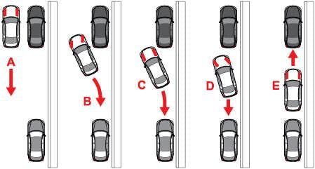

# Tutorial(03)

### To carry out a parallel parking between two cars.
Implement a model that manages a parking between two cars. The model has to have several modules which are responsible for different actions. One of the examples could be:
1. Module with controls the speed of the car, depends form the current action(e.g. parking, searching a parking place).
3. Module which looking for a gap between cars for the parking.
2. Module which controls a steering of the car during the parking process.

Each module should be as simple as possible.

To solve this tutorial you have to use at least 6 sensors, which measure the distance to objects which are located in front/left side/back of the car. The speed has to be around 0.5-1 m/s. At the picture you can see the main idea how the parking has to be done:

The parking process can be divided in 4 steps:  
1. Go straight until a place have been found.
2. When the place is found, go back and rotate the car.
3. When the car has reached appropriate point, rotate car in other direction to fit into given gap between the cars.
4. When the car is close to the car behind, stop and go forward until it reaches certain distance to the front car.

**Important to know, this wed-simulator is a simplified version and it does not change the angle of front wheels but an angle of the car entirely.**

Show the [solution](solution03.md).